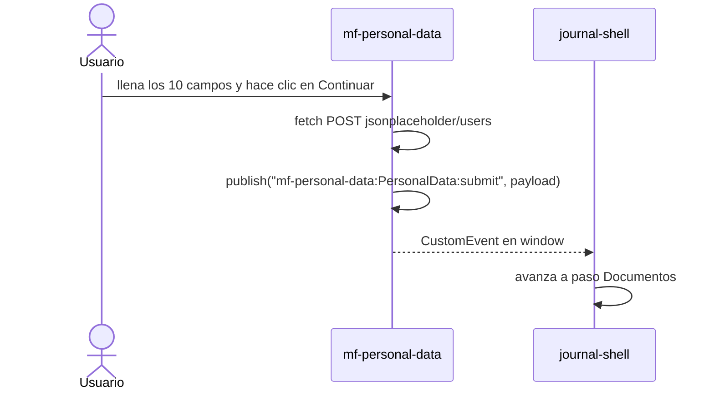

# mf-personal-data

**Vue 3.5 + Vite — Paso 3 del flujo de crédito hipotecario.**

Repositorio: [github.com/JairPrada/mf-personal-data](https://github.com/JairPrada/mf-personal-data)

Se monta en el shell después de la verificación OTP. Muestra un formulario de 10 campos para capturar los datos personales del usuario. Al enviar, emite un evento que el shell usa para avanzar a la carga de documentos.

---

## Componente: `PersonalData`

### Campos del formulario

| Campo | Tipo | Requerido |
|---|---|---|
| Nombres | texto | Sí |
| Primer apellido | texto | Sí |
| Segundo apellido | texto | No |
| Fecha de nacimiento | date | Sí |
| Género | select (Masculino / Femenino / Otro) | Sí |
| Estado civil | select (Soltero/a, Casado/a, Divorciado/a, Viudo/a, Unión libre) | Sí |
| Correo electrónico | texto con validación regex | Sí |
| Teléfono celular | texto, 7–15 dígitos | Sí |
| Dirección de residencia | texto | Sí |
| Ciudad | texto | Sí |

Validación en tiempo real con `computed`. Validación completa al submit con `validate()`.

---

## Evento que emite



| Evento | Payload |
|---|---|
| `mf-personal-data:PersonalData:submit` | `{ nombres, correo, telefono }` |

---

## Cómo funciona la integración con el shell

```html
"mf-personal-data": "http://localhost:3003/remoteEntry.js"
```

El shell llama:
```ts
hydrate("mf-personal-data", "PersonalData", containerEl, signal)
```

---

## Contrato de módulo (`src/index.ts`)

```ts
export default {
  manifest,
  mount(el, _component, props) { ... },  // crea la app Vue y la monta en el
  unmount(el) { ... },                   // llama app.unmount()
}
```

---

## CSS

Inyecta `remoteEntry.css` en el `<head>`. Las clases usan el prefijo `pd-`.

---

## Correr en local

```bash
pnpm build:contract
pnpm --filter mf-personal-data dev   # http://localhost:3003
```

